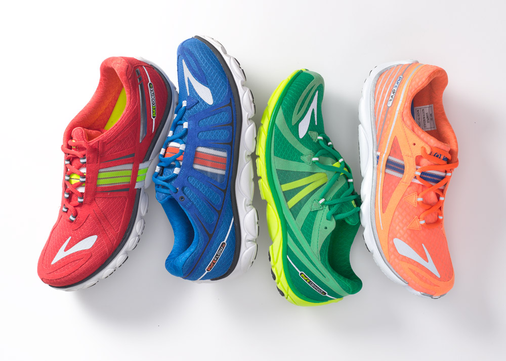

# Django ReST Framework: APIs in a Nutshell 

As backend developers, we arguably spend just as much time focusing on services and endpoints than front-facing rendering. APIs in Python are equally easy to set up in micro-frameworks or full-scale frameworks, but using Django allows has some packages to help make our lives easier.

Django REST framework, a third-party package, allows us to turn Django into a full-featured REST (Representational State Transfer) API. This is important because it gives us access to two specific benefits:
- it allows us to use the Django ORM and all the niceties that come along with that, and
- it's ridiculously easy to maintain both an API and a front end in the same application.

There are two main concepts that this introduces: the first is a serializer and the second is viewsets. When we work with the models, we use the model instances (objects) to access attributes directly and interact with them. Because an API doesn't have views in the traditional sense, we need a way to translate the model instances into a JSON format so that it can be easily parsed and controlled. The serializers handle the transformation from model instances to the views, then the class-based viewsets handle the formatting of the serialized data into a HTTP-compatible response. All of the [`ModelViewSet`](https://www.django-rest-framework.org/api-guide/viewsets/) classes implicitly allow GET requests, but you can do more by subclassing the "create" function and checking out the `@action` decorator.

## Your Task
This assignment is to use `Django REST` framework and a fresh Django server to create an API as a potential demo for a shoe store with the following models, broken out for standardization:

- Manufacturer
  - name: str
  - website: url
- ShoeType
  - style: str
- ShoeColor
  - color_name: str (ROYGBIV + white / black) --> [HINT](https://docs.djangoproject.com/en/3.0/ref/models/fields/#choices) 
- Shoe
  - size: int
  - brand name: str
  - manufacturer: FK (Foreign Key)
  - color: FK
  - material: str
  - shoe_type: FK
  - fasten_type: str

Use the [documentation on creating a custom management command](https://docs.djangoproject.com/en/3.0/howto/custom-management-commands/) to add a `bootstrap_data` command for `manage.py`. This command should do the following things:

1. Populate the ShoeType table with the following entries:
    - sneaker
    - boot
    - sandal
    - dress
    - other
2. Populate the ShoeColor table with the following entries:
    - Red
    - Orange
    - Yellow
    - Green
    - Blue
    - Indigo
    - Violet
    - White
  
## Where to Start?
- [Django REST Framework Quickstart](https://www.django-rest-framework.org/tutorial/quickstart/)
  
## Submitting Your Work
Copy and modify THIS repository to build your Django application that uses REST. When you merge your dev branch changes to master and push to your repo, it will trigger a Pull Request (PR) that your instructors will use to evaluate your progress and provide commentary.
  
